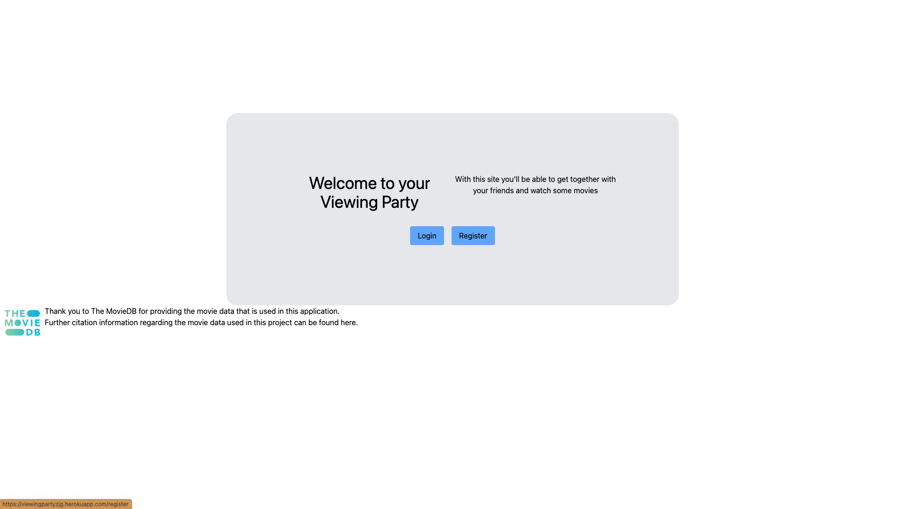
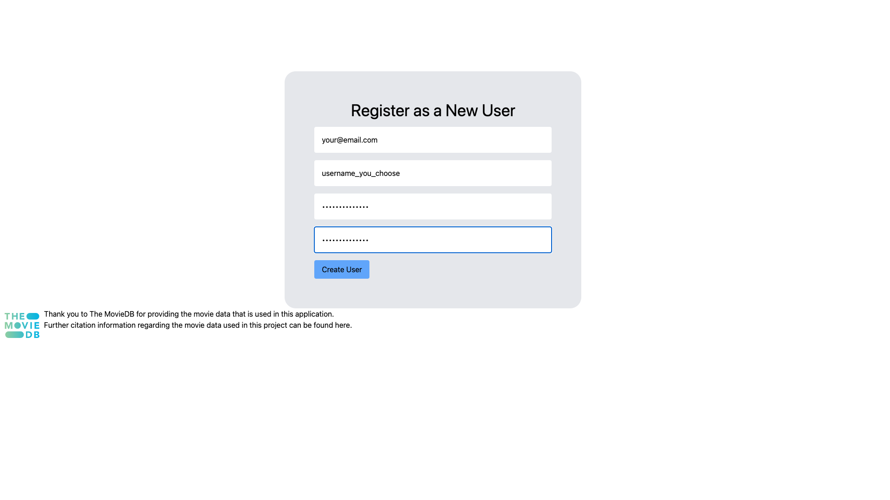
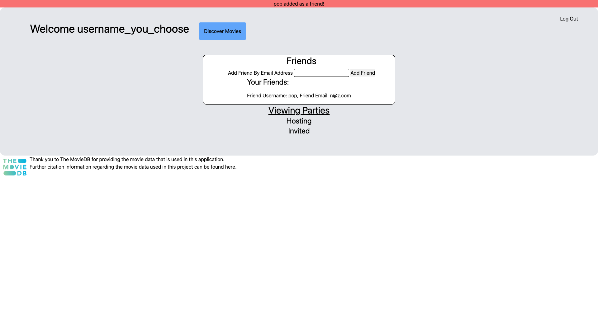
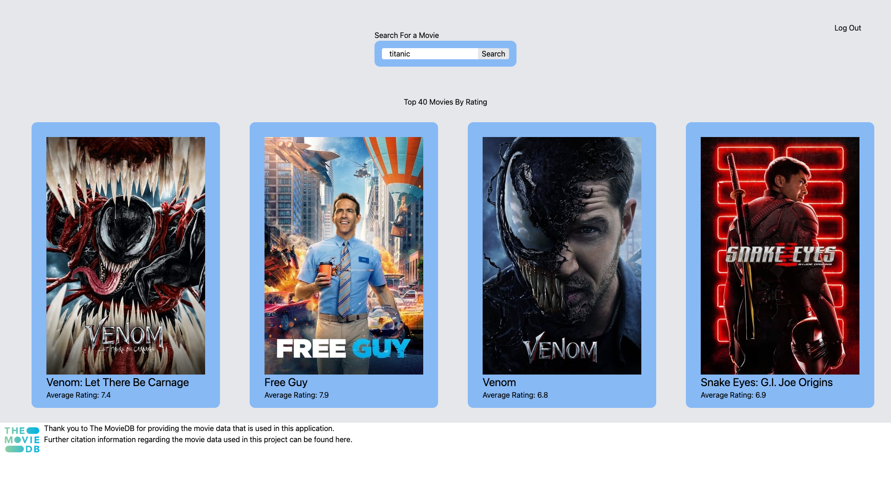
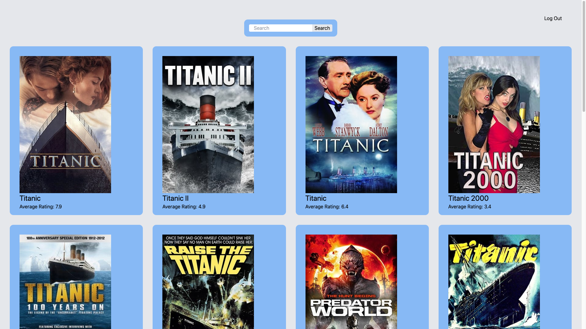
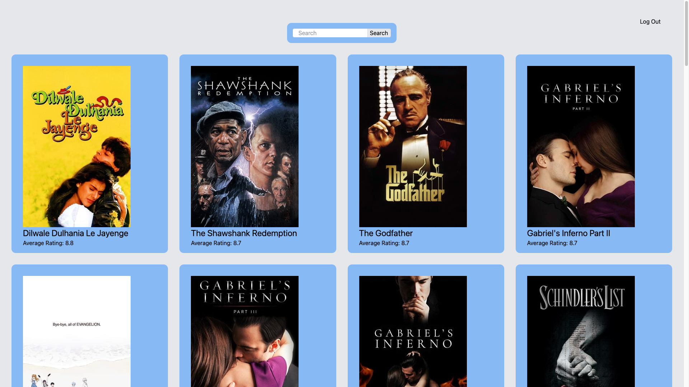
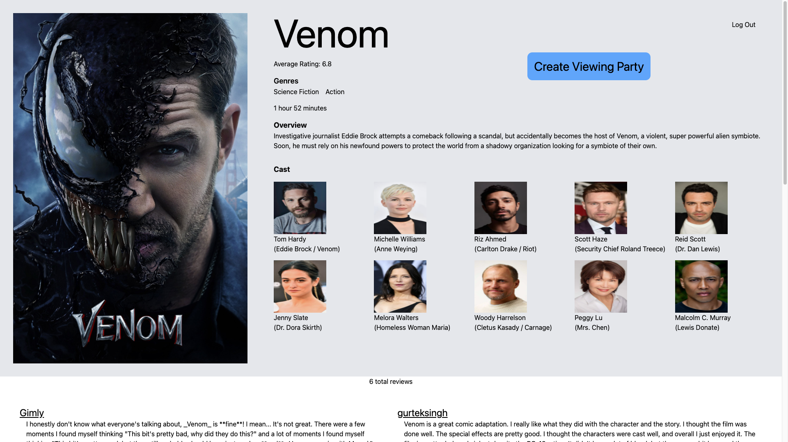
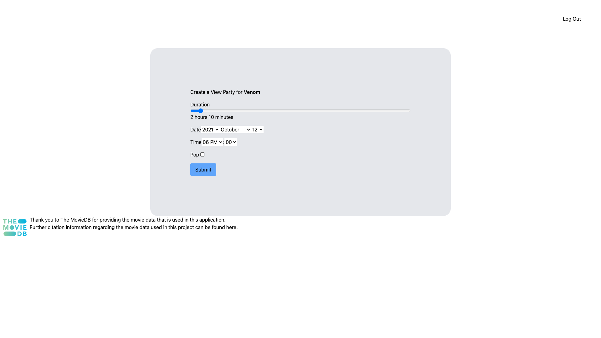
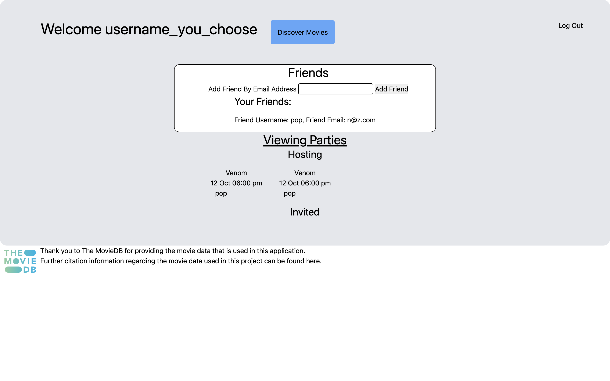
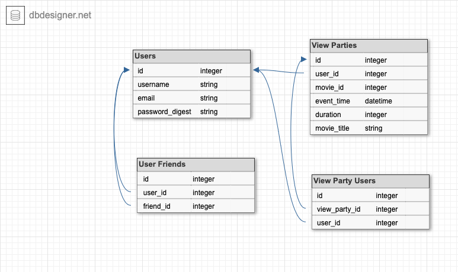

# Viewing Party 

---
# Our Devs:
* Noah Zinter [Github](https://github.com/NoahZinter) [LinkedIn](https://linkedin.com.in/noahzinter)

* Zach Green[Github](https://github.com/zachjamesgreen) [LinkedIn](https://linkedin.com.in/zachjamesgreen)

---

# Overview

Viewing Party deployed on

- [Heroku](https://viewingpartyzjg.herokuapp.com/)

Watch movies with your friends! Register with this app, add your friends, find a movie, and then start a viewing party. The movie data is from [The Movie Database](https://www.themoviedb.org/).

---

# Table of Contents
- [Overview](#overview)
- [Using Deployed App](#using-deployed-app)
- [Dependencies](#dependencies)
- [Database Schema](#database-schema)

---
 # Using Deployed App

### Registration 

First, click on the 'Register' button

Then, fill in your email, username, and password. 

### Adding Friends

You'll be redirected to your dashboard page. From here you can click to discover movies, or add friends. First, let's add a friend. 

Simply fill in your friend's email address in the provided line and click 'Add Friend'. They'll have to be registered on the app as well. 

Once you do you'll see a flash message confirming that your friend was added!

### Searching Movies

Let's search for a movie. When you click 'Discover Movies' you'll see 4 recommended movies, sorted by their rating. 

If you'd like to search for a movie, just type in the title and hit 'search'. Let's try 'Titanic'

We have 40 options! In case you meant a different one. 

Maybe you've got movie ennui. Then let's just see what's rated best. From the discover page, click 'Top 40 Movies by Rating'

And we have a list of 40 movies sorted by their rating! Great. 

### Movie Details

Let's go back to that Discover page and click on 'Venom'. We see more details. 

### Create A Viewing Party

Let's click that 'Create Viewing Party' button!

We have the option to set the date, time, and duration of the movie. And a little radio button to add our friends. We've only got the one, 'pop', so let's add them. 

Once we click submit, we'll see all the viewing parties we're hosting or attending, and a list of the attendees. 

---

# Dependencies

This application uses:

- Rails
- PostgreSQL
- TailwindCSS
- TravisCI
- Heroku
- [TMDB API](https://developers.themoviedb.org/3/getting-started/introduction)
- Figaro

___

# Installation

If you would like install this app locally you'll need to do a few things:

- Clone the code to your local machine `git clone git@github.com:noahzinter/viewing_party.git `
- `bundle install`
- `rails db:{create,migrate}`
- `bundle exec rails webpacker:install`
- `yarn install`
- Get API key from [The Movie Database](https://developers.themoviedb.org/3/getting-started/introduction)
- `bundle exec figaro install` and add you API key to the config/application.yml file (api_key: <key>)

Once you have done all that run `bundle exec rspec to make sure all tests are passing` and you're on your way.

___

# Database Schema

Our friends table uses a self referential relationship to better organize our data. 

